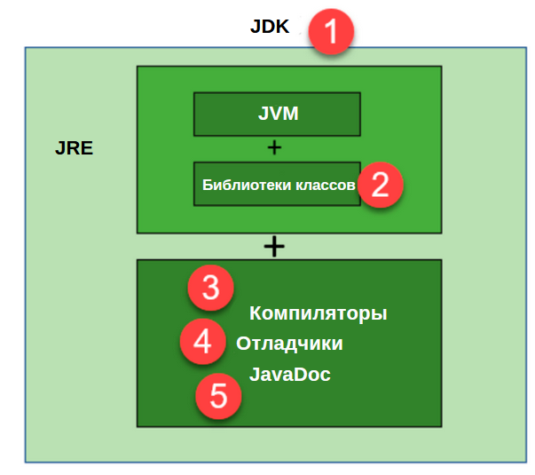
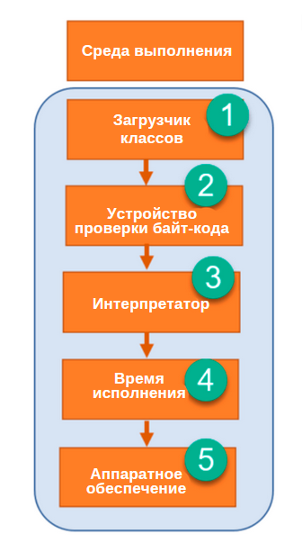
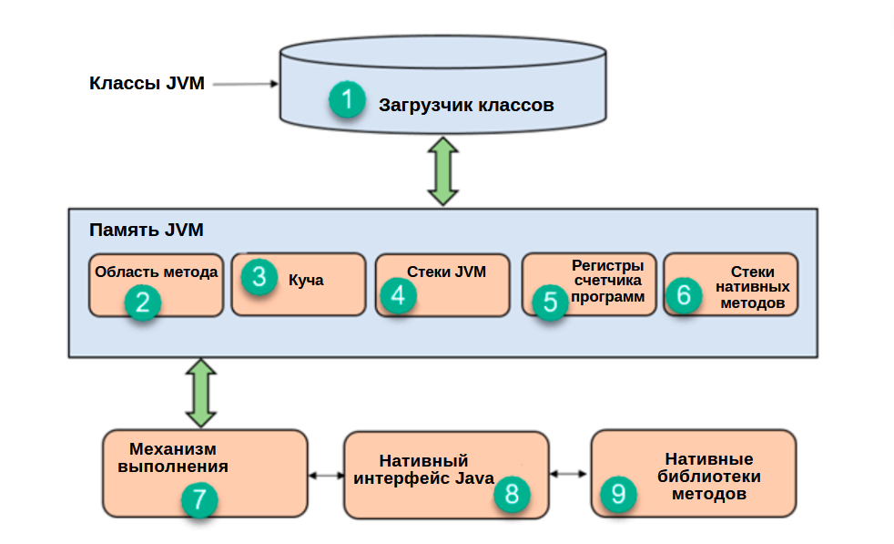

# JDK, JRE, JVM

## Ключевые отличия между JDK, JRE и JVM:

JDK – это набор средств для разработки программного обеспечения, JRE – это
программный пакет, с помощью которого можно запустить программу на Java, а
JVM – это среда для исполнения байт-кода.

JDK расшифровывается как «Java Development Kit», что переводится как «средства
разработки Java-программ»; JRE расшифровывается как «Java Runtime Environment»,
что переводится как «среда выполнения Java»; JVM расшифровывается как «Java
Virtual Machine», что переводится как «виртуальная машина Java».

JDK, JRE, JVM платформо-зависимые.

JDK содержит различные инструменты, необходимые для разработки, отладки и т.д.,
JRE содержит различные библиотеки классов и прочие вспомогательные файлы, а вот
JVM не содержит никаких инструментов разработки программного обеспечения.

В комплект JDK входит установщик, в то же время, JRE содержит лишь среду для
исполнения исходного кода, а вот JVM входит как в JDK, так и в JRE.

### Что такое JDK?

JDK – среда разработки программного обеспечения, которая применяется для
создания апплетов и Java-приложений. JDK расшифровывается как «Java Development
Kit», что переводится как «средства разработки Java-программ». Java-разработчики
могут использовать его в различных операционных системах – Windows, macOS,
Solaris и Linux. С помощью JDK они могут писать и запускать Java-программы.
Кроме того, предусмотрена возможность установки более, чем одной версии JDK на
одном и том же компьютере.

### Что такое JRE?

JRE – это часть программного обеспечения, которая предназначена для запуска
другого программного обеспечения. Она содержит библиотеки классов, загрузчики
классов и JVM. Попросту выражаясь, если вы хотите запустить какую-то
Java-программу, то вам нужен JRE. Если вы не являетесь программистом, то для
того, чтобы запускать Java-программы, вам не нужно устанавливать JDK, вам
достаточно наличия JRE. Впрочем, все версии JDK идут вместе с JRE, так что
вам не нужно отдельно загружать и устанавливать его на своем компьютере.
JRE расшифровывается как «Java Runtime Environment», что переводится как «среда
выполнения Java».

### Что такое JVM?

JVM – это программа, которая предоставляет среду выполнения для управления
Java-кодом и приложениями. Она преобразует байт-код Java в машинный код. JVM –
это часть JRE. Ее нельзя загрузить и установить отдельно от нее. Для того,
чтобы установить JVM, вам нужно установить JRE. JVM расшифровывается как «Java
Virtual Machine», что переводится как «виртуальная машина Java».

Во многих других языках программирования компиляторы создают машинный код для
какой-то определенной системы. А вот компилятор Java создает код для виртуальной
машины под названием JVM.

### Зачем нужен JDK?

Вот несколько важных аргументов в пользу JDK:

JDK содержит инструменты, которые необходимы для написания Java-программ, и JRE,
который необходим для их запуска.
Он состоит из компилятора, программы запуска Java-приложений, Appletviewer и
т.д.
Компилятор преобразует код, написанный на языке Java, в байт-код.
Программа запуска Java-приложений открывает JRE, загружает необходимые классы и
выполняет его метод Main.

### Зачем нужен JRE?

Вот несколько важных аргументов в пользу JRE:

JRE содержит библиотеки классов, JVM и прочие вспомогательные файлы. Но при этом
в него не входят такие инструменты Java-разработки, как отладчик, компилятор и
т.д.
Он использует такие немаловажные пакетные классы, как math, swingetc, util,
lang, awt и библиотеки среды выполнения.
Если вы планируете запускать Java-апплеты, то в вашей системе должен быть
установлен JRE.

### Зачем нужен JVM?

Вот несколько важных аргументов в пользу JVM:

JVM позволяет выполнять исходный Java-код не зависимо от платформы.
У нее есть большое количество библиотек, инструментов и фреймворков.
После того, как вы запустите Java-программу, вы сможете работать на любой
платформе и экономить, таким образом, довольно много времени.
JVM поставляется вместе с JIT-компилятором (JIT – Just-in-Time – «на лету»),
который преобразует исходный Java-код в низкоуровневый машинный код. А значит,
она работает куда быстрее, чем обычное приложение.

### Функции JDK

Вот самые важные функции JDK:

Он позволяет обрабатывать несколько исключений внутри блока catch.
У JDK есть все те же функции, что и у JRE.
Он содержит такие инструменты разработки, как компилятор, отладчик и т.д.
JDK предоставляет среду, которая необходима для разработки и исполнения
исходного Java-кода.
Его можно установить на таких операционных системах, как Windows, Unix и Mac.
Оператор diamond можно использовать для того, чтобы указать интерфейс общего
типа, а не прописывать его буквально.

### Функции JRE

Вот самые важные функции JRE:

JRE – это набор инструментов, который нужен для того, чтобы JVM работала.
JRE содержит технологию развертывания, в том числе Java Web Start и Java
Plug-in.
Разработчики могут с легкостью запустить исходный код с помощью JRE, но они не
смогут с ее помощью написать и скомпилировать Java-программу.
Она содержит интеграционные библиотеки, такие как Java Database Connectivity (
JDBC), Remote Method Invocation (RMI), Java Naming and Directory Interface (
JNDI) и другие.
У JRE есть клиент виртуальной машины JVM и HotSpot.

### Функции JVM

Вот самые важные функции JVM:

С ее помощью можно запускать приложения в облаке или прямо на вашем устройстве.
JVM преобразует байт-код в машино-зависимый код.
Она выполняет базовые функции Java, такие как управление памятью, безопасность,
сборка мусора и другие.
JVM запускает программы с помощью библиотек и файлов, которые предоставляет JRE.
JVM является частью JDK и JRE.
Она может выполнять Java-программу построчно, отсюда, ее другое название -
интерпретатор.
JVM можно довольно легко настроить под свои требования, например, вы можете
выделить для нее минимальный или максимальный объем памяти.
Она никак не зависит от «железа» и операционной системы. А это значит, что вы
можете написать Java-программу один раз и запускать ее потом где угодно.

### Как работает JDK?

Алгоритм работы JDK

Вот самые важные компоненты JDK:

JDK и JRE: программисты могут писать базовые программы на Java с помощью JDK и
запускать их посредством JRE, которая включает в себя JVM и библиотеки классов.

Библиотеки классов: это группа динамически загружаемых библиотек, которые
Java-программа может вызвать непосредственно во время исполнения.

Компиляторы: это Java-программа, которая принимает текстовый файл, написанный
разработчиком, и компилирует его в файл класса Java. Это стандартная форма
вывода компилятора, содержащая байт-код Java. Основной компилятор Java – это
Javac.

Отладчики: отладчик – это Java-программа, с помощью которой разработчики могут
тестировать и отлаживать программы Java.

JavaDoc: JavaDoc – это документация, которая была составлена компанией Sun
Microsystems специально для Java. Ее можно использовать для создания
API-документации в HTML-файле исходной программы.

### Как работает JRE?

Алгоритм работы JRE

JRE содержит экземпляр JVM, библиотеки и средства разработки. Как только вы
напишите и скомпилируете Java-код, компилятор создаст файл класса, который
содержит байт-код.

Вот самые важные компоненты JRE:

Загрузчик классов: загрузчик классов загружает различные классы, которые
необходимы для запуска Java-программы. JVM применяет три загрузчика классов:
базовый загрузчик, системный загрузчик и загрузчик расширений.

Устройство верификации байт-кода: это устройство проверяет байт-код для того,
чтобы он не нарушал работу интерпретатора.

Интерпретатор: после того, как классы будут загружены, а код проверен,
интерпретатор прочитает код строчка за строчкой.

Время исполнения: в основном система использует такое понятие, как время
исполнения, для того, чтобы описать период времени, в течение которого
выполняется какая-то конкретная программа.

Аппаратное обеспечение: после того, как исходный Java-код был скомпилирован, он
запускается на определенной аппаратной платформе.

В результате, Java-программа запускается в JRE.

### Как работает JVM?

Алгоритм работы JVM

Вот самые важные компоненты JVM:

Загрузчик классов
Загрузчик классов – это подсистема, которая применяется для загрузки файлов
классов. Он выполняет три основные функции, а именно загрузку, линковку и
инициализацию.

Область метода
Область метода JVM хранит структуру класса, то есть метаданные, код методов Java
и пул констант.

Динамическая область памяти (куча)
Все объекты, массивы и переменные экземпляров хранятся в куче. Эта память
является общей для нескольких потоков.

Стеки JVM
Стеки хранят локальные переменные, и их промежуточные результаты. У каждого
потока свой собственный стек, который был создан одновременно с самим потоком.
Когда вызывается метод, создается новый frame, а по завершении процесса вызова
метода он удаляется.

Регистры счетчика программ
Регистры PC хранят адрес выполняемой в данный момент инструкции JVM. Что
касается Java, то здесь каждый поток имеет свой собственный регистр.

Стеки нативных методов
Эти стеки содержат инструкции машинного кода, зависящего от нативных библиотек.
Он выделяет память в собственных кучах или использует любой другой стек.

Механизм выполнения
Это разновидность программного обеспечения, которое применяется для тестирования
программного обеспечения, железа и системы в целом. Механизм тестирования не
содержит никакой информации о тестируемом продукте.

Нативный интерфейс Java
Это интегрированная среда программирования. С ее помощью Java-код, запускаемый в
JVM, может вызывать библиотеки и нативные приложения.

Нативные библиотеки методов
Это набор платформенно-ориентированных библиотек (C, C++), которые требуются
механизму выполнения.

### Различия между JDK, JRE и JVM

Здесь представлены самые главные различие между JDK, JRE и JVM:

#### JDK

Расшифровка: Java Development Kit; перевод: средства разработки Java-программ

Эта средства разработки, необходимые для создания Java-приложений.

Платформо-зависимый

Содержит инструменты, необходимые для разработки, отладки и управления
Java-кодом.

Надмножество JRE

Позволяет разработчикам создавать Java-программы, которые можно выполнять и
запускать с помощью JRE и JVM.

Поставляется с установщиком.

#### JRE

Расшифровка: Java Runtime Environment; перевод: среда выполнения Java

Это программный пакет, который предоставляет библиотеки классов Java со всеми
компонентами, необходимыми для запуска Java-кода.

Платформо-зависимый

Содержит библиотеки классов и прочие вспомогательные файлы, которые необходимы
JVM для выполнения программ.

Подмножество JDK

JRE – это компонента Java, который создает JVM.

Содержит только среду для выполнения исходного кода.

#### JVM

Расшифровка: Java Virtual Machine; перевод: виртуальная машина Java

JVM выполняет байт-код Java и предоставляет среду для его выполнения.

Крайне платформо-зависимый

JVM не содержит инструменты для разработки ПО.

Подмножество JRE

Это компонент Java-платформы, который отвечает за выполнение исходного кода.

Встроена как в JDK, так и в JRE.

