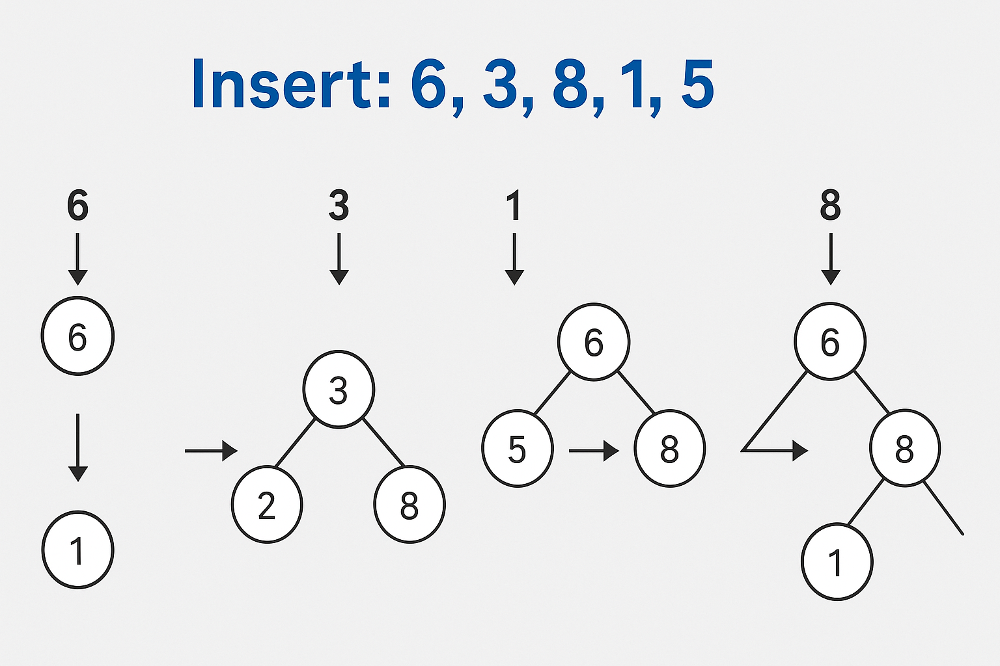
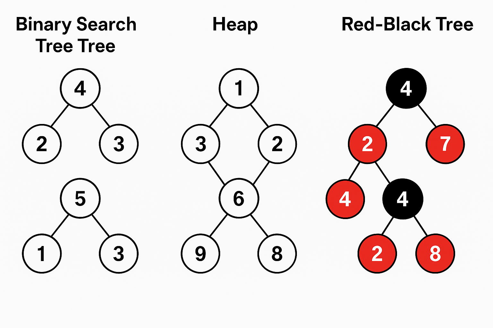
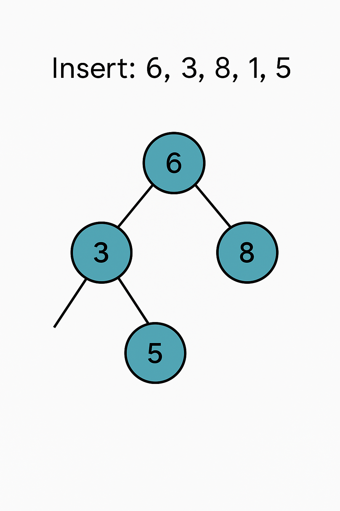

# Деревья

Деревья в Java — это одна из основных структур данных, кото рая используется для
представления иерархий, таких как каталоги, семейные деревья или структура
файлов. Деревья обладают особой важностью благодаря их способности эффективно
организовывать данные и обеспечивать быстрый поиск, вставку и удаление
элементов.

**Что такое дерево?**

Дерево состоит из узлов, каждый из которых может иметь:

- **Корень** — начальный узел дерева.
- **Ребра** — связи между узлами.
- **Листья** — узлы, не имеющие детей.
- **Узел** — элемент дерева, который может иметь несколько дочерних узлов.

### Термины:

- **Родитель** — узел, который содержит указатель на дочерние узлы.
- **Потомок** — узел, на который указывает родитель.
- **Глубина** — расстояние от корня до узла.
- **Высота** — максимальная глубина в дереве.
- **Дерево поиска (BST)** — дерево, в котором для каждого узла значение левого
  поддерева меньше, чем значение самого узла, а значение правого поддерева
  больше.

===============

В Java ты можешь работать с разными **видами деревьев**, как вручную, так и
через стандартные структуры (`TreeMap`, `TreeSet` и т. д.). Вот обзор **основных
типов деревьев**, используемых на практике:

---

## 🌳 1. **Бинарное дерево (Binary Tree)**

Каждый узел имеет **не более двух потомков** (левый и правый).

🧱 Используется как основа для других видов деревьев.


-------------
Бинарное дерево — это базовая и важная структура данных, на которой основаны многие другие деревья (включая кучи, деревья поиска, и т. д.).

---

## 🌳 Что такое бинарное дерево?

**Бинарное дерево** — это дерево, где **каждый узел может иметь не более двух потомков**:

* **левый потомок (left child)**
* **правый потомок (right child)**

---

## 📦 Пример структуры узла в Java:

```java
class Node {
    int value;
    Node left;
    Node right;

    Node(int value) {
        this.value = value;
    }
}
```

---

## 📊 Визуальный пример бинарного дерева:

```
        10
       /  \
      5    15
     / \     \
    2   7     20
```

---

## 🔄 Виды обхода дерева (DFS):

1. **In-order** (лево → корень → право):
   Выводит значения по порядку в **BST**
   → 2 5 7 10 15 20

2. **Pre-order** (корень → лево → право):
   → 10 5 2 7 15 20

3. **Post-order** (лево → право → корень):
   → 2 7 5 20 15 10

Также есть **обход в ширину (BFS)** — по уровням.

---

## 🧠 Свойства бинарного дерева:

| Свойство                                             | Значение      |
| ---------------------------------------------------- | ------------- |
| Максимальное количество узлов на уровне `n`          | `2^n`         |
| Максимальное количество узлов в дереве с высотой `h` | `2^(h+1) - 1` |
| Минимальная высота при `n` узлах                     | `log₂(n)`     |

---

## 📌 Виды бинарных деревьев:

| Вид дерева                          | Описание                                                     |
| ----------------------------------- | ------------------------------------------------------------ |
| **Полное (Complete)**               | Все уровни заполнены, кроме последнего — слева направо       |
| **Полное идеальное (Full/Perfect)** | Все узлы имеют 0 или 2 потомка, все листья — на одном уровне |
| **Сбалансированное (Balanced)**     | Разница высот поддеревьев ≤ 1                                |
| **BST (поиск)**                     | Левый < узел < правый                                        |

---

Хочешь, я покажу на схеме разные виды бинарных деревьев?

-----------
---

## 🌲 2. **Бинарное дерево поиска (Binary Search Tree — BST)**

Условие:

* Левые потомки < узла
* Правые потомки > узла

🚫 Может быть несбалансированным — эффективность операций может упасть до O(n).

Бинарное дерево поиска (BST — **Binary Search Tree**) — это разновидность бинарного дерева, где значения организованы так, чтобы **обеспечить быстрый поиск, вставку и удаление**.

---

## 🌲 Что такое BST?

**BST** — это бинарное дерево, в котором для каждого узла выполняется:

```
все значения в левом поддереве < значение узла < все значения в правом поддереве
```

📌 Это ключевое свойство делает возможным **логарифмический поиск**.

---

## 📦 Структура узла в Java:

```java
class Node {
    int value;
    Node left;
    Node right;

    Node(int value) {
        this.value = value;
    }
}
```

---

## 🔢 Пример BST:

```
        10
       /  \
      5    15
     / \     \
    2   7     20
```

* Все в левом поддереве от 10 < 10
* Все в правом поддереве от 10 > 10

---

## 🧠 Операции и их сложность:

| Операция | Среднее  | Худшее (несбалансированное дерево) |
| -------- | -------- | ---------------------------------- |
| Поиск    | O(log n) | O(n)                               |
| Вставка  | O(log n) | O(n)                               |
| Удаление | O(log n) | O(n)                               |

---

## 🔄 Обходы дерева (DFS):

1. **In-order**: левый → узел → правый
   📌 В BST даёт отсортированный список!

2. **Pre-order**: узел → левый → правый

3. **Post-order**: левый → правый → узел

---

## 🔥 Преимущества BST:

* Быстрый поиск
* Легко реализовать и понять
* Используется в множествах, словарях, базах данных

---

## ⚠️ Недостаток:

BST **может вырождаться в список**, если данные вставляются в отсортированном порядке:

```
1 → 2 → 3 → 4 → 5
```

📉 Тогда все операции становятся O(n)

👉 Решение: использовать **самобалансирующиеся деревья** (AVL, Red-Black)

---

Хочешь, я покажу пошагово, как вставляются элементы в BST?



Это изображение иллюстрирует **пошаговую вставку значений** `6, 3, 8, 1, 5` в **бинарное дерево поиска (BST)**. Ниже разбираем каждую фазу:

---

### 🔷 Шаг 1: Вставка `6`

* Дерево было пустым
  ➡ `6` становится **корнем**

```
6
```

---

### 🔷 Шаг 2: Вставка `3`

* `3 < 6`
  ➡ Идёт в **левое поддерево** от `6`

```
  6
 /
3
```

---

### 🔷 Шаг 3: Вставка `8`

* `8 > 6`
  ➡ Идёт в **правое поддерево** от `6`

```
  6
 / \
3   8
```

---

### 🔷 Шаг 4: Вставка `1`

* `1 < 6` → влево
* `1 < 3` → влево от `3`

```
    6
   / \
  3   8
 /
1
```

---

### 🔷 Шаг 5: Вставка `5`

* `5 < 6` → влево
* `5 > 3` → вправо от `3`

```
    6
   / \
  3   8
 / \
1   5
```

---

### ✅ Итоговое BST:

* Все левые узлы < родителя
* Все правые узлы > родителя
* Обход in-order даст: `1 3 5 6 8` (отсортированный)

Хочешь, я покажу, как происходит удаление узла из BST?


---

## 🔴⚫ 3. **Красно-чёрное дерево (Red-Black Tree)**

Самобалансирующееся бинарное дерево поиска.
✅ Поддерживает высоту ≈ O(log n)

📦 Используется в:

* `TreeMap`
* `TreeSet`

---

## 🟢 4. **AVL-дерево**

Ещё один тип самобалансирующегося BST
⚖️ Баланс поддерживается строго (по разнице высот ≤ 1)

📌 Менее распространено в стандартной Java, но часто используется вручную или в
библиотеках.

---

## 🧱 5. **Куча (Heap)**

Бинарное дерево, где:

* **Max-heap**: родитель ≥ потомков
* **Min-heap**: родитель ≤ потомков

📦 Используется в:

* `PriorityQueue` (в виде **бинарной кучи**)

---

## 🔗 6. **Двоичное дерево с двусвязными узлами (Linked Binary Tree)**

Вручную реализуемое дерево, где каждый узел содержит `left`, `right`, и, иногда,
`parent`.

---

## 🌿 7. **N-арное дерево (N-ary Tree)**

Каждый узел может иметь **любое количество потомков**
🧰 Используется в парсерах, XML-деревьях и т. д.

---

## 🗂 8. **Trie (Префиксное дерево)**

Специализированное дерево для хранения строк.
Эффективно для поиска по префиксу.
Часто используется в:

* Автодополнении
* Поиске слов

---

## 🧠 В Java Collections Framework:

| Класс           | Основан на           |
|-----------------|----------------------|
| `TreeMap`       | Красно-чёрное дерево |
| `TreeSet`       | Красно-чёрное дерево |
| `PriorityQueue` | Бинарная куча        |

---

Хочешь, я покажу на примере, как различаются BST, Heap и Red-Black Tree по
структуре?



На изображении показано сравнение **трёх типов бинарных деревьев**:

---

### 1. 🌲 **Binary Search Tree (BST)** (слева):

* Соблюдает правило:
  **левый < корень < правый**
* Пример:

  ```
        8
       / \
      4   12
     / \   \
    2   6   14
  ```
* Нет балансировки — возможна деградация до списка

---

### 2. 🟢 **Heap** (в центре):

* Это **Min-Heap**: каждый родитель ≤ потомков
* Гарантирует, что **минимум — в корне**
* Не обязательно отсортирован влево/вправо:

  ```
        1
       / \
      3   5
     / \
    4   8
  ```
* Используется в `PriorityQueue`

---

### 3. 🔴⚫ **Red-Black Tree** (справа):

* Это **сбалансированное BST**
* Сохраняет порядок, как BST, но дополнительно:

    * Каждый узел — **красный или чёрный**
    * Следует ряду правил (например, путь от корня до листа содержит одинаковое
      число чёрных узлов)
* Обеспечивает **высоту ≈ log(n)**

📦 Применяется в `TreeMap`, `TreeSet`

---

Хочешь, я объясню основные правила красно-чёрного дерева?

----

Хорошо! Ниже объясню основные **правила красно-чёрного дерева (Red-Black Tree)
** — это самобалансирующееся бинарное дерево поиска, используемое в Java (
`TreeMap`, `TreeSet`).

---

## 🔴⚫ Основные свойства красно-чёрного дерева:

Каждый узел имеет цвет: **красный (R)** или **чёрный (B)**. Далее — ключевые
правила:

### 1. **Каждый узел либо красный, либо чёрный**

— Это базовое определение

---

### 2. **Корень всегда чёрный**

— Это помогает поддерживать равномерную высоту дерева

---

### 3. **Все листья (null-узлы) считаются чёрными**

— Даже если они не хранят значения (это "пустые указатели")

---

### 4. **Красный узел не может иметь красных потомков**

— То есть, **не может быть двух красных узлов подряд**
📌 Это правило запрещает длинные красные цепочки и помогает балансировать дерево

---

### 5. **Путь от любого узла до всех его потомков-листьев содержит одинаковое
количество чёрных узлов**

— Это называется **чёрная высота** (black height)
✅ Это ключевое свойство, которое ограничивает высоту дерева

---

## 📉 Благодаря этим правилам:

* Максимальная глубина дерева — **не более чем в 2 раза больше логарифма числа
  узлов**
  ⇒ Поиск, вставка, удаление работают за `O(log n)`

---

## 🔁 Балансировка при вставке и удалении:

* Нарушение одного из правил вызывает **повторную окраску** и/или **ротации**:

    * **Левая/правая ротация** — поворот поддерева для восстановления структуры
    * **Перекраска** — смена цвета узлов

---

## 🧠 Где используется:

| Java класс | Основан на           |
|------------|----------------------|
| `TreeMap`  | Красно-чёрное дерево |
| `TreeSet`  | Красно-чёрное дерево |

---


================

## 1. **БИНАРНОЕ ДЕРЕВО(Binary Tree)**

**Бинарное дерево** — это дерево, где **каждый узел имеет не более двух потомков
**:

* Левый (`left`)
* Правый (`right`)

---

## 📦 Пример узла бинарного дерева в Java:

```java
class Node {
    int value;
    Node left;
    Node right;

    Node(int value) {
        this.value = value;
    }
}
```

---

## 🔁 Пример простого бинарного дерева:

```java
        10
        /  \
        5 15
        / \
        2 7
```

---

## 🧠 Основные виды бинарных деревьев:

| Вид                                   | Описание                                          |
|---------------------------------------|---------------------------------------------------|
| **Обычное бинарное дерево**           | Нет ограничений на размещение значений            |
| **Бинарное дерево поиска (BST)**      | Левые значения < узел < правые                    |
| **Полное бинарное дерево**            | Все уровни, кроме последнего, полностью заполнены |
| **Сбалансированное (AVL, Red-Black)** | Поддерживает высоту ≈ `log(n)`                    |
| **Heap (Куча)**                       | Родитель ≥ или ≤ потомков (в зависимости от типа) |

---

## 🔍 Операции в бинарном дереве:

| Операция        | Время (BST)                       |
|-----------------|-----------------------------------|
| Вставка         | O(log n) в среднем, O(n) в худшем |
| Поиск           | O(log n) в среднем                |
| Удаление        | O(log n) в среднем                |
| Обход (DFS/BFS) | O(n)                              |

---

## 📌 Примеры обходов (DFS):

1. **Inorder (сортированный для BST)**:

   ```java
   void inorder(Node node) {
       if (node != null) {
           inorder(node.left);
           System.out.print(node.value + " ");
           inorder(node.right);
       }
   }
   ```

2. **Preorder**:
   `node → left → right`

3. **Postorder**:
   `left → right → node`

---

## 🧱 Где используется бинарное дерево в Java:

* `TreeMap` и `TreeSet` — на базе **красно-чёрного дерева**
* Приоритетные очереди, сортировки, компиляторы и т.д.

Хочешь, я покажу на схеме, как вставляются элементы в бинарное дерево поиска?



На изображении показан **бинарный дерево поиска (BST)**, построенное путём
вставки чисел в следующем порядке:
**6 → 3 → 8 → 1 → 5**

---

## 🔢 Шаги вставки и структура:

1. **Вставка 6**

    * Дерево пусто → 6 становится корнем

2. **Вставка 3**

    * 3 < 6 → идёт влево от 6

3. **Вставка 8**

    * 8 > 6 → идёт вправо от 6

4. **Вставка 1**

    * 1 < 6 → влево
    * 1 < 3 → влево от 3

5. **Вставка 5**

    * 5 < 6 → влево
    * 5 > 3 → вправо от 3

---

## 📐 Полученное дерево:

```
      6
     / \
    3   8
   / \
  1   5
```

Это классическое **сбалансированное бинарное дерево поиска**, в котором:

* У каждого узла:

    * Левые потомки < текущего значения
    * Правые потомки > текущего значения

---

Хочешь, я покажу, как будет выглядеть обход этого дерева в порядке **inorder** (
слева → корень → справа)?


---


**Обычное бинарное дерево**
**Бинарное дерево поиска (BST)**

**Полное бинарное дерево**
**Сбалансированное (AVL, Red-Black)**
**Heap (Куча)**

### 2. **Бинарное дерево поиска (Binary Search Tree, BST)**

Это особый вид бинарного дерева, в котором для каждого узла выполняется
следующее правило:

- Все значения в левом поддереве узла меньше его значения.
- Все значения в правом поддереве узла больше его значения.

#### Пример: Вставка и поиск в BST

```java
public class BinarySearchTree {
    class Node {
        int value;
        Node left, right;

        Node(int value) {
            this.value = value;
            left = right = null;
        }
    }

    Node root;

    public BinarySearchTree() {
        root = null;
    }

    // Вставка в BST
    public void insert(int value) {
        root = insertRec(root, value);
    }

    private Node insertRec(Node root, int value) {
        if (root == null) {
            root = new Node(value);
            return root;
        }
        if (value < root.value) {
            root.left = insertRec(root.left, value);
        } else if (value > root.value) {
            root.right = insertRec(root.right, value);
        }
        return root;
    }

    // Поиск в BST
    public Node search(int value) {
        return searchRec(root, value);
    }

    private Node searchRec(Node root, int value) {
        if (root == null || root.value == value)
            return root;

        if (value < root.value)
            return searchRec(root.left, value);

        return searchRec(root.right, value);
    }
}
```

---

## 🌳 Разница между обычным **бинарным деревом поиска (BST)** и **красно-чёрным

деревом**:

| Свойство                         | BST (обычное)                         | Красно-чёрное дерево                     |
|----------------------------------|---------------------------------------|------------------------------------------|
| Структура                        | Дерево, где `лево < корень < право`   | То же самое                              |
| Балансировка                     | **Не гарантирована**                  | **Гарантированная балансировка**         |
| Время поиска (в худшем случае)   | O(n) — если дерево вырождено в список | O(log n)                                 |
| Цвет узлов                       | Нет                                   | Каждый узел — **красный** или **чёрный** |
| Автоматическое поддержание формы | Нет                                   | Да, после вставки/удаления               |
| Используется в                   | Обучающие задачи, простые случаи      | `TreeMap`, `TreeSet` в Java              |

---

### 📌 Красно-чёрное дерево — это *самобалансирующийся BST*

Оно добавляет **правила**, которые гарантируют, что дерево не становится
«вытянутым» (то есть глубина всегда \~ log(n)):

#### Основные правила красно-чёрного дерева:

1. Каждый узел — **красный** или **чёрный**.
2. Корень — **чёрный**.
3. У красного узла **оба ребёнка — чёрные**.
4. Все пути от узла до листьев содержат **одинаковое количество чёрных узлов**.
5. Вставки и удаления могут вызывать **повороты** и **перекраски**, чтобы
   сохранить эти свойства.

---

### 📘 В Java:

* `TreeMap` и `TreeSet` используют **красно-чёрное дерево**.
* Это позволяет им выполнять `put`, `get`, `remove`, `firstKey` и т.д. за **O(
  log n)**.

---


---

### 3. **Сбалансированные деревья**

Сбалансированные деревья имеют особое свойство — они поддерживают свою высоту на
низком уровне, что позволяет обеспечить более эффективные операции вставки и
поиска.

#### Примеры:

- **Красно-черное дерево (Red-Black Tree)** — самобалансирующееся дерево поиска,
  где каждый узел имеет цвет (красный или черный), и определенные свойства
  поддерживаются для балансировки.
- **AVL-дерево** — другое самобалансирующееся дерево поиска, где балансировка
  поддерживается на основе высоты поддеревьев.

---

### 4. **Дерево отрезков (Segment Tree)**

Дерево отрезков — это структура данных, предназначенная для эффективного решения
задач на отрезках (например, нахождение минимального, максимального или суммы на
промежутке).

---

### 5. **Дерево с кучей (Heap)**

Это специальное дерево, используемое для реализации приоритетных очередей. В
куче:

- **Min-heap** — родительский элемент меньше или равен своим детям.
- **Max-heap** — родительский элемент больше или равен своим детям.

#### Пример использования `PriorityQueue` (реализует Min-heap):

```java
PriorityQueue<Integer> pq = new PriorityQueue<>();
pq.

offer(10);
pq.

offer(20);
pq.

offer(5);
System.out.

println(pq.poll()); // 5 (минимум)
```

---

## 🧠 Важные особенности

| Тип дерева               | Применение                       | Операции                      |
|--------------------------|----------------------------------|-------------------------------|
| **Бинарное дерево**      | Простые задачи с деревьями       | O(log n) для поиска/вставки   |
| **BST (Дерево поиска)**  | Быстрый поиск, вставка, удаление | O(log n) (в сбалансированном) |
| **Красно-черное дерево** | Поддержание сбалансированности   | O(log n) для всех операций    |
| **AVL-дерево**           | Высокая сбалансированность       | O(log n) для всех операций    |
| **Куча (Heap)**          | Реализация приоритетной очереди  | O(log n) для всех операций    |

---

## 🧩 Заключение

- **Деревья** являются важной структурой данных, особенно для задач, связанных с
  иерархическими данными и эффективным поиском.
- В Java можно использовать стандартные библиотеки для работы с деревьями, такие
  как `TreeMap`, `TreeSet`, `PriorityQueue`.
- Для более специфичных задач, таких как **сбалансированные деревья** (AVL,
  Red-Black), можно воспользоваться существующими библиотеками или реализовать
  их вручную.

---

Если хочешь увидеть код для конкретного типа дерева (например, AVL или
красно-черное дерево), дай знать!